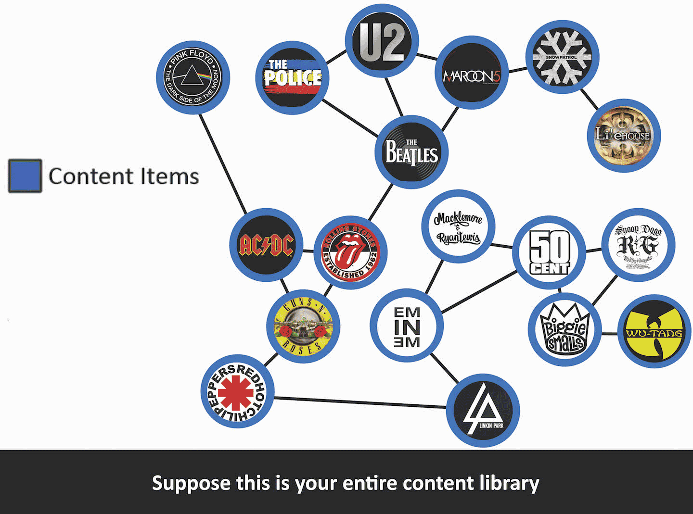

# Serendipitous Recommender Template
Alex Simes

*This README is a work in progress.*

This is the recommender used in my Master's thesis project. It provides both baseline (collaborative) recommendations and serendipitous recommendations. Serendipitous recommendations are pre-calculated upon training, using the algorithm proposed by Zhang et al. in their [2012 paper](https://www.researchgate.net/publication/221519984_Auralist_Introducing_serendipity_into_music_recommendation).

Below is a short animation illustrating how the serendipitous algorithm works.



##Quick Setup
- Install PredictionIO, follow their [guide](https://docs.prediction.io/install/)
- Use pio command line to get this template. This command will copy the template to a directory 'Recommender'
```bash
pio template get alex9311/predictionio-serendipitous-recommender-template Recommender
```
- create a new PredictionIO application and build it. 
```bash
cd Recommender
pio app new Recommender
pio build
```
- Add items to event store, use json to load in bulk. Json for items should have the following format
```json
{"event":"$set","entityType":"item","entityId":"item1","properties":{"category":"a","title":"title for a1", "date_created":"2016-05-01"}}
{"event":"$set","entityType":"item","entityId":"item2","properties":{"category":"a","title":"title for a2", "date_created":"2016-04-01"}}
{"event":"$set","entityType":"item","entityId":"item3","properties":{"category":"b","title":"title for b3", "date_created":"2016-03-01"}}
```
- To load the file use the following command, your app id is shown after calling `pio app new` or `pio app list` after creating it.
```bash
pio import --appid <your_appid> --input ~/items.json
```
- Add views to event store, same basic idea as items. The view events json file should have the following format
```json
{"event":"view","entityType":"user","entityId":"user1","targetEntityType":"item","targetEntityId":"item1"}
{"event":"view","entityType":"user","entityId":"user2","targetEntityType":"item","targetEntityId":"item2"}
```
```bash
pio import --appid <your_appid> --input ~/events.json
```
- train, deploy
```bash
pio train
pio deploy
```

- Use the engine
```bash
curl -H "Content-Type: application/json" -d '{ "user": "user1", "num": 4, "recommender":"baseline"}' http://localhost:8000/queries.json
